# Todo App (NestJS + React)
Aplikasi Todo sederhana dengan Backend NestJS dan Frontend React (Vite). Mendukung fitur add, edit, search, toggle status, dan delete, serta sudah ter-Dockerize.

### 🚀 Cara Menjalankan Aplikasi
#### 1. Backend
```
npm install
```
```
npm run start:dev
```

#### 2. Frontend
```
npm install
```
```
npm run dev
```

#### 3. Docker 
```
docker compose up --build
```

### 🧰 Versi Teknologi
1. Node.js : v20.17.0
2. Backend : Nest.js
3. Frontend : React.js + Vite
4. Container : Docker Compose / Docker

### ⚙️ Keputusan Teknis (Singkat)
1. In-memory storage digunakan agar aplikasi ringan dan mudah dijalankan tanpa konfigurasi database.
2. SweetAlert2 digunakan di frontend untuk meningkatkan UX pada aksi create, update, delete, dan konfirmasi.
3. Docker containerization digunakan agar environment pengembangan dan deployment konsisten di berbagai mesin tanpa konfigurasi manual.

### Screenshot
#### Pengujian di Postman
1. X-user-id ada <br>
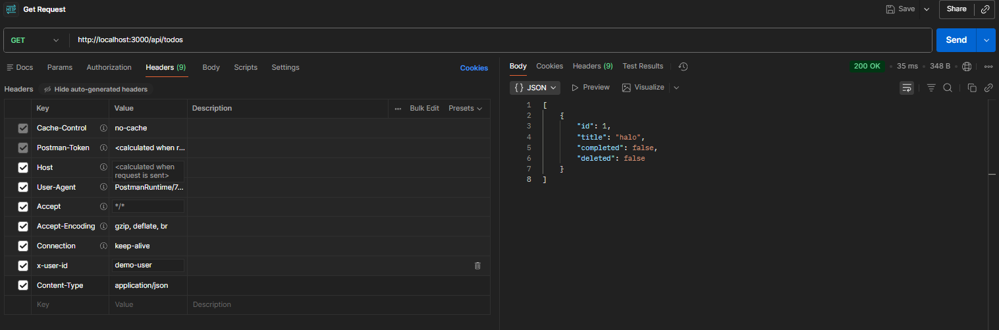</a>
2. x-user-id tidak ada <br>
</a>
3. add success <br>
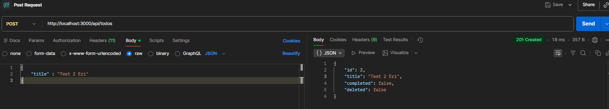</a>
4. search success <br>
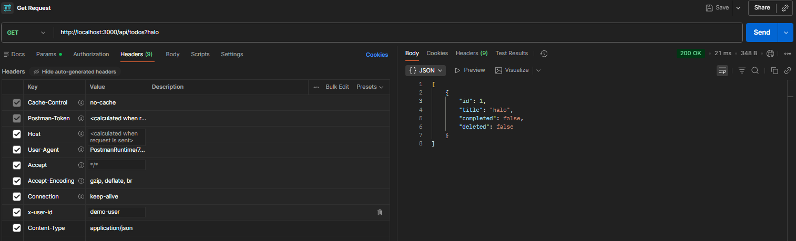</a>
5. toggle update True <br>
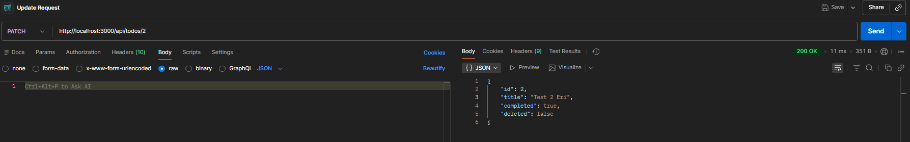</a>
6. update <br>
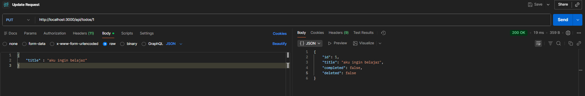</a>
7. delete <br>
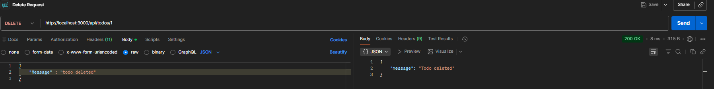</a>


#### Pengujian di Interface (UI)
1. UI Add Success <br>
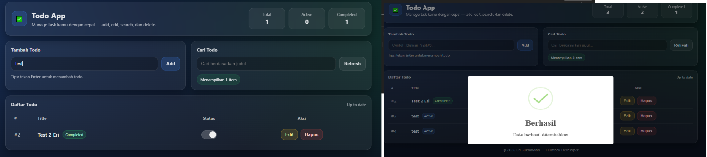</a>
2. UI Add Failed <br>
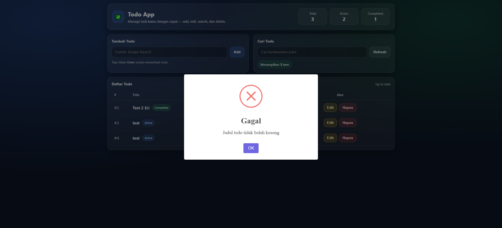</a>
3. UI Search Success <br>
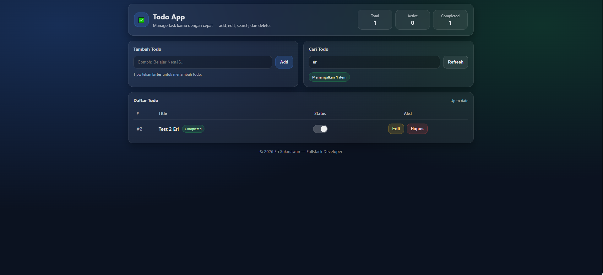</a>
4. UI Toggle Update Success <br>
</a>
5. UI Update Data Success <br>
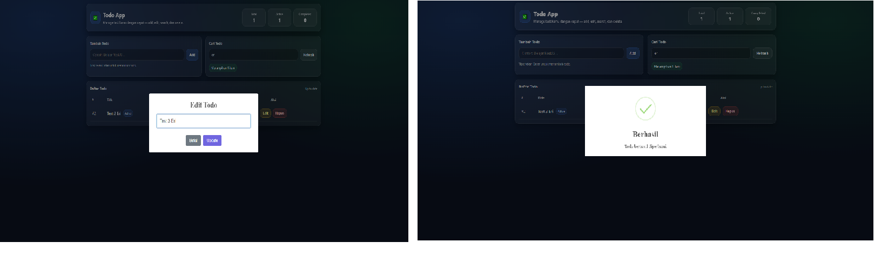</a>
6. UI Delete Success <br>
</a>


#### Docker Desktop
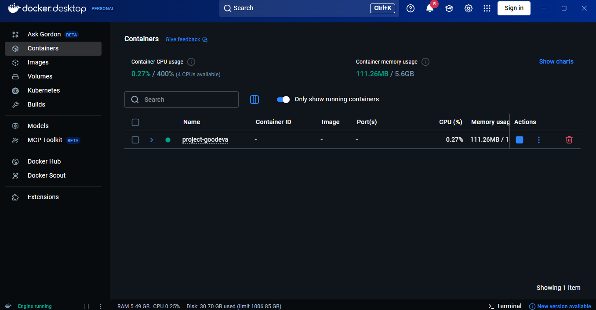</a>
